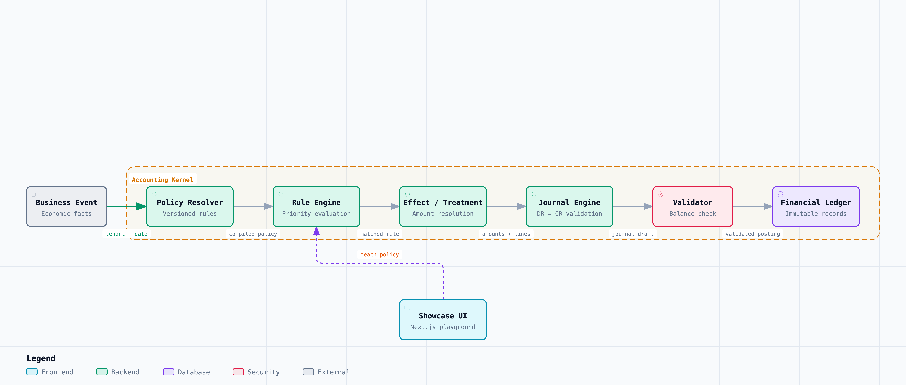

# KANAKKU

> **Speak English. Kanakku handles the accounting.**

An open-source accounting engine that turns business intent into **deterministic, auditable, double-entry accounting**.

<p align="center">
  <video src="https://github.com/user-attachments/assets/c6b4a7b4-dac4-4308-a8a0-e2ad10c5dd5e" controls width="100%" alt="KANAKKU Accounting Engine Demo"></video>
</p>

<p align="center">
  <strong>See KANAKKU in action.</strong><br>
  From a business event to policy resolution, journal generation, validation, and ledger posting.
</p>

<p align="center">
  <a href="https://kanakku1.vercel.app"><strong>▶ Try KANAKKU Live</strong></a>
  &nbsp; · &nbsp;
  <a href="docs/ARCHITECTURE.md">Architecture</a>
  &nbsp; · &nbsp;
  <a href="https://github.com/jai2010/kanakku">GitHub</a>
</p>

---

## What is KANAKKU?

KANAKKU treats accounting as a **programmable layer** between what happens in a business and what ultimately appears in the books.

Instead of embedding accounting behaviour across application code, services, workflows, and one-off exceptions, KANAKKU makes the accounting model explicit:

```text
Business Event
      │
      ▼
Accounting Policy
      │
      ▼
Rules & Treatments
      │
      ▼
Journal
      │
      ▼
Validation
      │
      ▼
Ledger
```

The goal is simple:

> **Describe what happened and how the business wants it accounted for. Let KANAKKU make the accounting explicit, testable, balanced, and auditable.**

---

## See the Accounting Model

KANAKKU separates the operational event from the accounting logic used to interpret it.

### Business Event

**What happened?**

Examples:

```text
A seller made a ₹10,000 sale on my marketplace.

A buyer loaded ₹10,000 into their wallet.

I paid FashionHub ₹1,720 as a seller payout.

I refunded ₹5,000 to a buyer.
```

### Accounting Policy

**How should my business account for it?**

Policies define the accounting behaviour for those events.

### Deterministic Engine

**Execute the policy.**

KANAKKU resolves the applicable policy, evaluates rules, calculates effects, generates journal entries, validates double-entry, and posts the result to the ledger.

---

## AI Is Optional

KANAKKU can use an LLM through **Accounting Studio** to translate natural-language accounting intent into structured policy DSL.

The LLM is an **authoring layer**, not the accounting engine.

```text
Natural Language
       │
       ▼
   LLM / AI
       │
       ▼
  Policy DSL
       │
       ▼
Deterministic Accounting Engine
       │
       ▼
 Journal → Validation → Ledger
```

This separation is intentional.

**AI helps express accounting intent. The deterministic engine executes the accounting.**

KANAKKU can also run without an LLM.

---

## Product

### Transactions

Capture and inspect the business events flowing through the system.

<p align="center">
  
</p>

### Accounting Studio

Define accounting intent and policies using natural language and structured policy definitions.

<p align="center">
  
</p>

### Ledger

See the financial books produced by the accounting engine.

<p align="center">
  
</p>

### Reconciliation

Compare external activity against what KANAKKU accounted for.

<p align="center">
  
</p>

---

## Demo Use Case: Marketplace Accounting

The repository includes a **marketplace accounting demo use case**, written from the **marketplace's accounting perspective**.

A marketplace might define its policy as:

```text
Track what each seller is owed from marketplace sales.

Deduct a 5% marketplace fee and 18% tax
before calculating the seller's eligible payout.
```

For a ₹10,000 marketplace sale, the configured policy produces:

```text
Gross sale                 ₹10,000
Marketplace fee               ₹500
Tax                            ₹900
──────────────────────────────────
Seller balance               ₹8,600
```

KANAKKU then generates the corresponding balanced journal:

```text
DR Cash                      ₹10,000
CR Seller Payable            ₹10,000

DR Seller Payable               ₹500
CR Marketplace Fee Revenue      ₹500

DR Seller Payable               ₹900
CR Tax Payable                  ₹900
```

The important part is not only the result.

**The accounting path is visible and traceable.**

See the repository for the complete marketplace example and policy flow.

---

## Why KANAKKU?

### Programmable

Accounting behaviour is represented as explicit policies and rules rather than scattered application logic.

### Deterministic

The accounting engine executes validated policy predictably. The core accounting path does not depend on an LLM.

### Explainable

A transaction can be traced from business event through policy, rules, journal generation, validation, and ledger posting.

### Double-entry by construction

Journals are validated before posting:

```text
Total Debits = Total Credits
```

### Auditable

The accounting path is explicit rather than hidden inside application code.

### Separate by design

Operational events and financial accounting remain distinct concepts, connected through accounting policy.

---

## Architecture

<p align="center">
  
</p>

At the core of KANAKKU is a layered accounting pipeline:

```text
Business Transaction
        │
        ▼
┌─────────────────────┐
│   Policy Resolver   │
└──────────┬──────────┘
           ▼
┌─────────────────────┐
│   Rule Evaluation   │
└──────────┬──────────┘
           ▼
┌─────────────────────┐
│ Effect / Treatment  │
└──────────┬──────────┘
           ▼
┌─────────────────────┐
│  Journal Generation │
└──────────┬──────────┘
           ▼
┌─────────────────────┐
│ Validator / Balance │
└──────────┬──────────┘
           ▼
┌─────────────────────┐
│    Ledger Posting   │
└─────────────────────┘
```

Each stage has a defined responsibility, making the accounting process inspectable rather than a black box.

For the detailed architecture, see [`docs/ARCHITECTURE.md`](docs/ARCHITECTURE.md).

---

## What's Included

The current implementation includes:

- Business events
- Accounting policies
- Policy versions
- Rules and rule evaluation
- Transaction effects
- Journal generation
- Double-entry validation
- Ledger posting
- Reconciliation
- Accounting Studio
- Configurable LLM providers
- Deterministic accounting behaviour

---

## Try KANAKKU

<p align="center">
  <a href="https://kanakku1.vercel.app">
    <strong>▶ Open the KANAKKU Playground</strong>
  </a>
</p>

Explore the accounting engine, transactions, Accounting Studio, ledger, and reconciliation.

<p align="center">
  <a href="https://github.com/jai2010/kanakku">
    <strong>View the source on GitHub →</strong>
  </a>
</p>

---

## Getting Started

Clone the repository:

```bash
git clone https://github.com/jai2010/kanakku.git
cd kanakku
```

Install dependencies:

```bash
npm install
```

Start the development environment:

```bash
npm run dev
```

Run tests:

```bash
npm test
```

For the current scripts and configuration, see `package.json`.

---

## Project Status

KANAKKU is an actively developed open-source project.

The accounting model, APIs, and data model are still evolving.

> **KANAKKU is an early-stage project and should not yet be treated as production accounting infrastructure.**

Contributions, ideas, and feedback are welcome.

---

<p align="center">
  <strong>KANAKKU</strong><br>
  Speak English. Kanakku handles the accounting.
</p>
