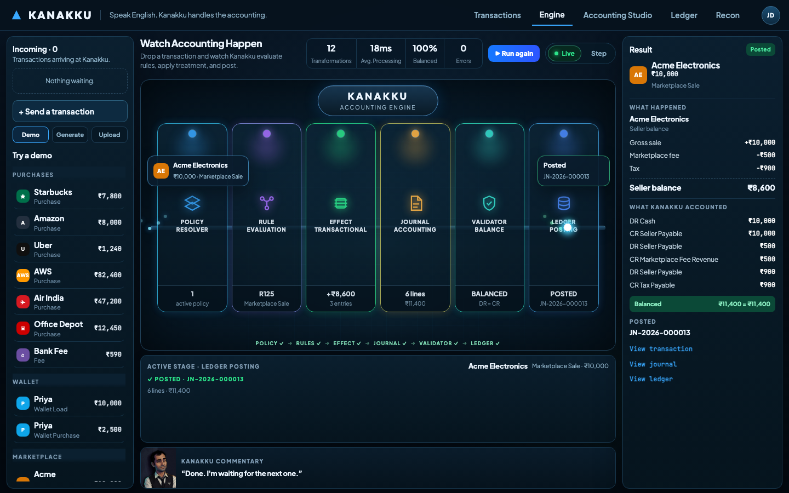
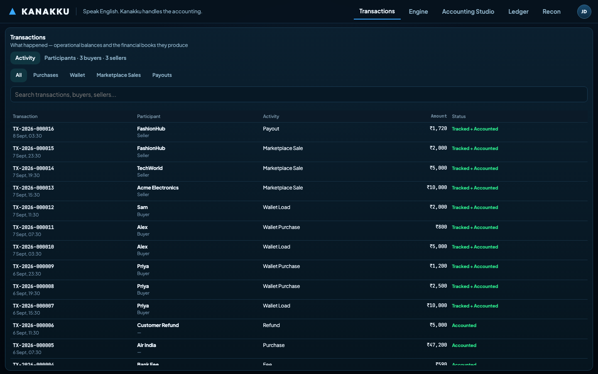
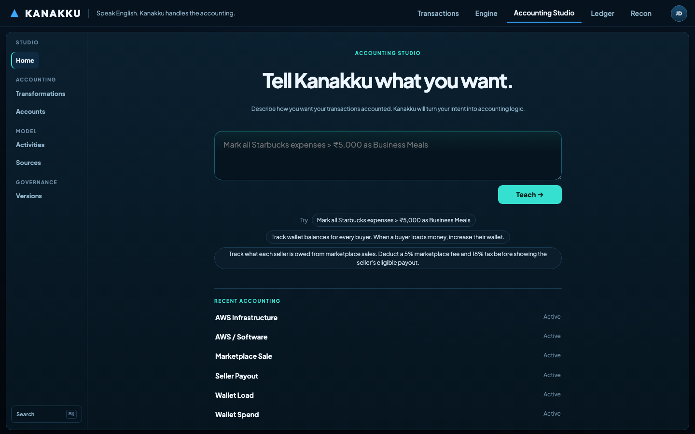
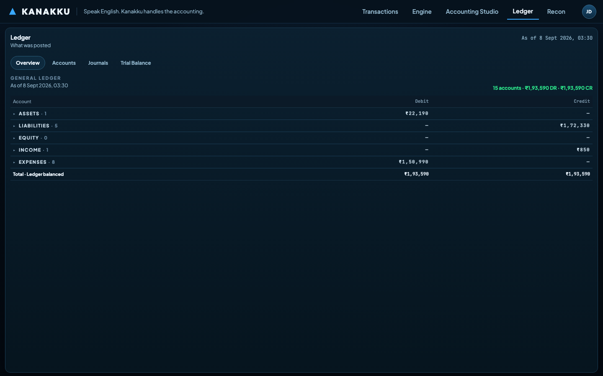
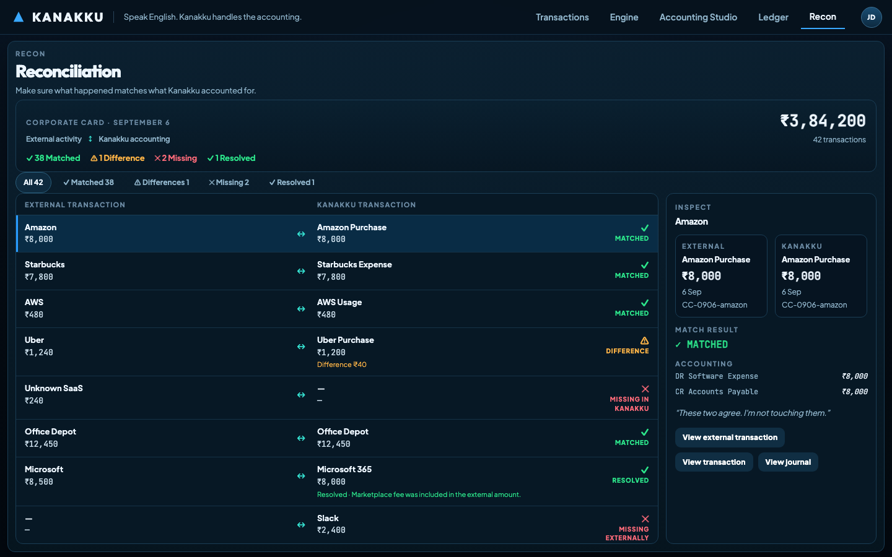

# KANAKKU

<p align="center">
  <strong>Speak English. Kanakku handles the accounting.</strong>
</p>

<p align="center">
  A programmable accounting engine that turns business intent into deterministic,
  auditable, double-entry accounting.
</p>

<p align="center">
  <a href="https://github.com/jai2010/kanakku">
    
  </a>
  <a href="https://github.com/jai2010/kanakku/issues">
    
  </a>
  <a href="LICENSE">
    
  </a>
</p>

<p align="center">
  
</p>

<p align="center">
  <strong>Watch accounting happen.</strong><br>
  A transaction moves through policy resolution, rule evaluation, treatment,
  journal generation, validation, and ledger posting.
</p>

<p align="center">
  <a href="https://kanakku1.vercel.app">▶ Try KANAKKU Live</a>
  ·
  <a href="docs/ARCHITECTURE.md">Architecture</a>
  ·
  <a href="CONTRIBUTING.md">Contributing</a>
  ·
  <a href="LICENSE">License</a>
</p>

---

## What is KANAKKU?

KANAKKU is an open-source accounting engine designed to make accounting logic **programmable, explainable, and deterministic**.

Instead of burying accounting behaviour inside application code, KANAKKU separates:

**business intent → accounting policy → rules → transaction effects → journal → validation → ledger**

The goal is simple:

> **Speak English. Kanakku handles the accounting.**

A business should be able to express what it wants its accounting to do, while the engine makes the resulting accounting explicit, testable, balanced, and auditable.

---

## The Accounting Engine

KANAKKU treats accounting as a pipeline rather than a black box.

```text
Business Transaction
        │
        ▼
┌─────────────────────┐
│   Policy Resolver   │
└──────────┬──────────┘
           ▼
┌─────────────────────┐
│   Rule Evaluation   │
└──────────┬──────────┘
           ▼
┌─────────────────────┐
│ Effect / Treatment  │
└──────────┬──────────┘
           ▼
┌─────────────────────┐
│  Journal Accounting │
└──────────┬──────────┘
           ▼
┌─────────────────────┐
│ Validator / Balance │
└──────────┬──────────┘
           ▼
┌─────────────────────┐
│    Ledger Posting   │
└─────────────────────┘
```

Every stage has a defined responsibility.

The result is accounting that can be inspected rather than merely trusted.

---

## Why KANAKKU?

Traditional application accounting often ends up looking like:

```text
if purchase && merchant == "Amazon"
    debit ...
    credit ...
```

As businesses grow, accounting logic becomes scattered across services, workflows, database procedures, and one-off exceptions.

KANAKKU moves that logic into an explicit accounting model.

### Human intent

Business users describe accounting behaviour in natural language.

### Explicit policy

Intent is represented as structured accounting policy rather than hidden application logic.

### Deterministic execution

The accounting engine executes validated policy and produces predictable results.

### Double-entry by construction

Journal entries are validated before posting.

### Auditability

The engine can explain how a transaction became a journal and ultimately a ledger posting.

### Separation of concerns

Operational transactions and financial accounting remain distinct concepts.

---

## See It In Action

### Transactions

Track the operational events flowing through the system.

<p align="center">
  
</p>

### Accounting Studio

Describe accounting intent and teach KANAKKU how transactions should be treated.

<p align="center">
  
</p>

### Ledger

See the financial books produced by the accounting engine.

<p align="center">
  
</p>

### Reconciliation

Compare external activity against what KANAKKU accounted for.

<p align="center">
  
</p>

---

## Example

Consider a marketplace sale of ₹10,000.

The business might express its intent as:

```text
Track what each seller is owed from marketplace sales.

Deduct a 5% marketplace fee and 18% tax
before calculating the seller's eligible payout.
```

KANAKKU turns that intent into accounting behaviour.

The engine can then determine:

```text
Gross sale                 ₹10,000
Marketplace fee               ₹500
Tax                            ₹900
──────────────────────────────────
Seller balance               ₹8,600
```

And produce a balanced journal:

```text
DR Cash                      ₹10,000
CR Seller Payable            ₹10,000

DR Seller Payable               ₹500
CR Marketplace Fee Revenue      ₹500

DR Seller Payable               ₹900
CR Tax Payable                  ₹900
```

The important part isn't just the resulting numbers.

**The accounting path is visible.**

---

## Core Principles

### Deterministic execution

The accounting engine should not depend on an LLM to decide how accounting is executed.

AI can help translate human intent into accounting policy.

The resulting policy must be validated before deterministic execution.

### Balanced journals

Every posted journal must satisfy:

```text
Total Debits = Total Credits
```

### Explicit accounting

Accounting decisions should be represented as data and policy rather than hidden inside application code.

### Auditability

A transaction should be traceable from its operational event through the accounting policy, rules, journal, validation, and ledger.

### Separation of operational and financial models

What happened operationally and how it should be accounted for are related, but they are not the same thing.

---

## Architecture

KANAKKU is built around a layered accounting model:

```text
                    Business Intent
                           │
                           ▼
                  ┌─────────────────┐
                  │ Policy / Intent │
                  └────────┬────────┘
                           │
                           ▼
                  ┌─────────────────┐
                  │   Rule Engine   │
                  └────────┬────────┘
                           │
                           ▼
                  ┌─────────────────┐
                  │     Effects     │
                  └────────┬────────┘
                           │
                           ▼
                  ┌─────────────────┐
                  │ Journal Engine  │
                  └────────┬────────┘
                           │
                           ▼
                  ┌─────────────────┐
                  │    Validator    │
                  └────────┬────────┘
                           │
                           ▼
                  ┌─────────────────┐
                  │     Ledger      │
                  └─────────────────┘
```

See [`docs/ARCHITECTURE.md`](docs/ARCHITECTURE.md) for the detailed architecture.

---

## Project Status

KANAKKU is an actively developed open-source project.

The current implementation focuses on the core accounting model and engine, including:

- Business events
- Accounting policies
- Policy versions
- Rules and rule evaluation
- Transaction effects
- Journal generation
- Double-entry validation
- Ledger posting
- Reconciliation
- Accounting Studio
- Deterministic accounting behaviour

The APIs and data model are still evolving.

**This is an early-stage project and should not yet be treated as production accounting infrastructure.**

---

## Getting Started

Clone the repository:

```bash
git clone https://github.com/jai2010/kanakku.git
cd kanakku
```

Install dependencies:

```bash
npm install
```

Run the development environment:

```bash
npm run dev
```

Run tests:

```bash
npm test
```

> Commands may evolve as the project develops. Check `package.json` for the current scripts.

---

## Repository Structure

```text
kanakku/
├── src/                  # Accounting engine and domain logic
├── tests/                # Engine and domain tests
├── docs/
│   ├── ARCHITECTURE.md   # Architecture documentation
│   └── media/            # README product screenshots and demo
├── public/               # Application assets
├── README.md
└── LICENSE
```

---

## Contributing

KANAKKU is intended to be built in the open.

Contributions, ideas, bug reports, accounting-model discussions, and architectural feedback are welcome.

Please read [`CONTRIBUTING.md`](CONTRIBUTING.md) before submitting a pull request.

---

## Security

If you discover a security vulnerability, please do not open a public issue with sensitive details.

See [`SECURITY.md`](SECURITY.md) for the responsible disclosure process.

---

## License

KANAKKU is open source.

See [`LICENSE`](LICENSE) for the license terms.

---

<p align="center">
  <strong>KANAKKU</strong><br>
  Speak English. Kanakku handles the accounting.
</p>
